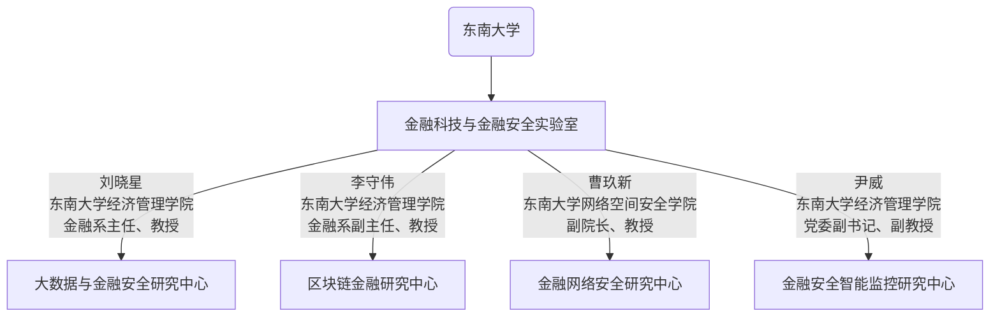

2023 年 10 月召开的中央金融工作会议提出加快建设金融强国的宏伟目标，习近平总书记在 2024 年 1 月 16 日省部级主要领导干部推动金融高质量发展专题研讨班开班式上对这一目标进行了全面阐释。习近平总书记指示“金融安全是国家安全的重要组成部分，准确判断风险隐患是保障金融安全的前提。 ”值此中国式现代化的重要历史时期， 信息科技与数字化大幅提升金融运营效率和创新能力的同时，金融作为现代经济制高点更要兼顾技术创新与安全，加强风险防控能力，维护金融安全，为中国式现代化保驾护航。

金融科技与金融安全实验室正是在这一背景下，依托东南大学经济管理学院与东南大学网络空间安全学院，建设的集”产业转化-教学科研“与一体的实验平台。

